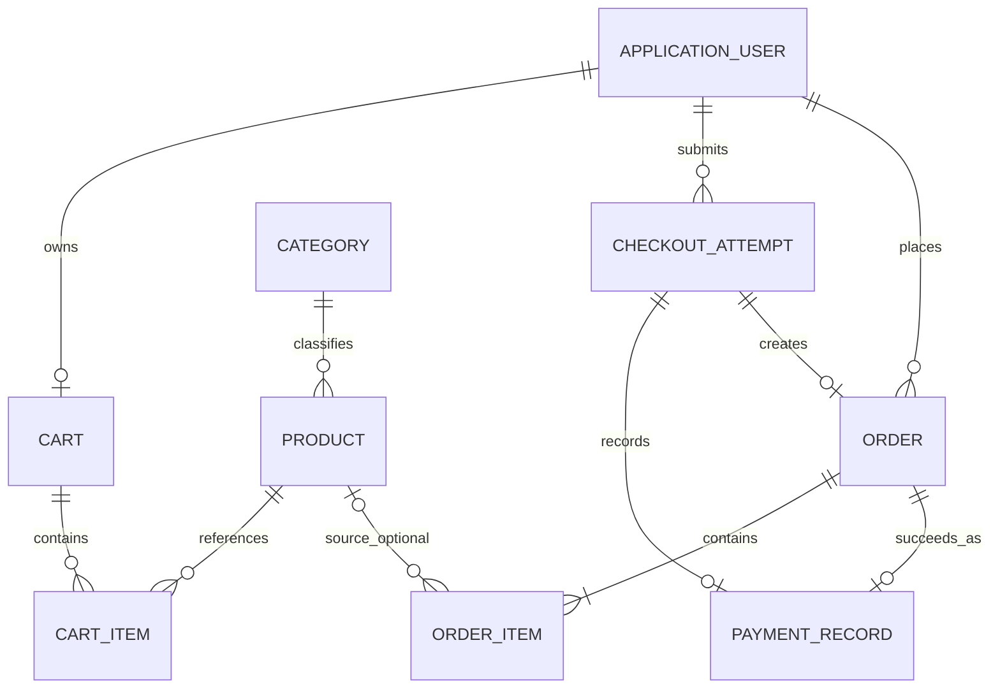

# ECommerceStore Database Design

## 1. Scope and conventions

The default store is a single SQLite database accessed through EF Core 8. This design is provider-aware: entity APIs use C# `decimal` for money, but SQLite stores exact scaled minor units as `INTEGER` because SQLite does not enforce `decimal(18,2)` and provider decimal ordering/aggregation can otherwise be unreliable.

Conventions:

- Primary keys: `int` for catalog/cart entities and `long` for append-heavy commerce entities; Identity uses its standard string key.
- Time: `DateTime` named `*Utc`, normalized to UTC, stored in a consistently sortable provider representation.
- Strings: explicit maximum lengths; required strings trimmed and reject whitespace-only input.
- Enums: stored as integers with application validation; unknown values rejected.
- Money: C# `decimal`, logical precision `18`, scale `2`, exact SQLite `INTEGER` minor units through one tested converter; see §6.
- Concurrency: application-managed `int Version`, configured as a concurrency token, incremented on mutation.
- Soft lifecycle: `IsActive` for catalog records, `IsEnabled` for users. Historical records are not physically deleted.
- All timestamps and audit fields are server generated; clients cannot bind them.

## 2. Relationship diagram



Identity's standard user-role relationship also connects `ApplicationUser` to `IdentityRole` through `IdentityUserRole<string>`; standard Identity token/claim/login tables remain framework-owned and are never projected into admin views.

## 3. Entity definitions

### 3.1 `ApplicationUser`

Extends `IdentityUser<string>`.

| Field | C# / SQLite | Required | Limits/defaults/constraints |
|---|---|---:|---|
| `Id` | `string` / TEXT | yes | PK; Identity-generated; max 450 for cross-provider compatibility |
| `FirstName` | `string` / TEXT | yes | max 100; trimmed; nonblank |
| `LastName` | `string` / TEXT | yes | max 100; trimmed; nonblank |
| `Email` | Identity string / TEXT | yes for app | max 256; valid email at input |
| `NormalizedEmail` | Identity string / TEXT | yes | max 256; unique index |
| `PhoneNumber` | Identity string / TEXT | no | max 30; normalized/validated display phone |
| `IsEnabled` | `bool` / INTEGER | yes | default true |
| `CreatedAtUtc` | `DateTime` / TEXT or INTEGER | yes | server UTC; immutable |
| `UpdatedAtUtc` | `DateTime` / TEXT or INTEGER | yes | server UTC |

Identity-managed fields (`PasswordHash`, `SecurityStamp`, `ConcurrencyStamp`, lockout, access-failure, two-factor, normalized username, etc.) retain framework configuration. `UserName` equals email for this app. Identity's `ConcurrencyStamp` protects Identity updates; no separate integer `Version` is added to avoid two competing mechanisms.

Indexes:

- Standard Identity indexes, with unique `NormalizedUserName` and unique `NormalizedEmail` (Identity's email index must be explicitly made unique).
- Optional non-unique `(IsEnabled, CreatedAtUtc)` for paginated admin customer lists after query-plan verification.

Delete: `Restrict/NoAction` from `Cart`, `Order`, and `CheckoutAttempt`. Account administration disables users; it does not delete users with commerce history.

### 3.2 `Category`

| Field | C# / SQLite | Required | Limits/defaults/constraints |
|---|---|---:|---|
| `Id` | `int` / INTEGER | yes | PK, generated |
| `Name` | `string` / TEXT | yes | max 100; nonblank; `NOCASE` collation for display sorting |
| `NormalizedName` | `string` / TEXT | yes | max 100; uppercase/invariant normalization; unique |
| `Slug` | `string` / TEXT | yes | max 120; lowercase ASCII slug; unique |
| `IsActive` | `bool` / INTEGER | yes | default true |
| `CreatedAtUtc` | `DateTime` | yes | server UTC |
| `UpdatedAtUtc` | `DateTime` | yes | server UTC |
| `Version` | `int` / INTEGER | yes | default 1; concurrency token; `> 0` |

Relationships: one category to many products. Delete is `Restrict`; referenced categories must be deactivated.

Indexes: unique `NormalizedName`; unique `Slug`; `(IsActive, Name, Id)` for public/admin lists.

### 3.3 `Product`

| Field | C# / SQLite | Required | Limits/defaults/constraints |
|---|---|---:|---|
| `Id` | `int` / INTEGER | yes | PK, generated |
| `CategoryId` | `int` / INTEGER | yes | FK → `Category.Id` |
| `Name` | `string` / TEXT | yes | max 200; nonblank; `NOCASE` collation for A–Z/Z–A sorting |
| `Slug` | `string` / TEXT | yes | max 220; lowercase ASCII; unique |
| `ShortDescription` | `string` / TEXT | yes | max 500; plain text |
| `FullDescription` | `string` / TEXT | yes | max 8,000; plain text/encoded output |
| `NormalPrice` | `decimal` / INTEGER minor | yes | logical `decimal(18,2)`; `>= 0`; max `9,999,999,999,999,999.99` |
| `DiscountPrice` | `decimal?` / INTEGER minor | no | when present `>= 0` and `< NormalPrice`; max as above |
| `StockQuantity` | `int` / INTEGER | yes | `0..1,000,000` |
| `ImageKind` | enum / INTEGER | yes | `None=0`, `Local=1`, `ExternalUrl=2` |
| `ImageLocation` | `string` / TEXT | no | max 2,048 external URL or max 260 managed relative path; consistent with kind |
| `IsActive` | `bool` / INTEGER | yes | default true |
| `IsFeatured` | `bool` / INTEGER | yes | default false |
| `CreatedAtUtc` | `DateTime` | yes | server UTC |
| `UpdatedAtUtc` | `DateTime` | yes | server UTC |
| `Version` | `int` / INTEGER | yes | default 1; concurrency token; `> 0` |

Checks where SQLite supports them:

- `NormalPriceMinor >= 0`.
- `DiscountPriceMinor IS NULL OR (DiscountPriceMinor >= 0 AND DiscountPriceMinor < NormalPriceMinor)`.
- `StockQuantity BETWEEN 0 AND 1000000`.
- `ImageKind` within declared enum and location presence matches kind (also enforced in service).

Indexes:

- Unique `Slug`.
- `(CategoryId, IsActive, Name, Id)`.
- `(IsActive, IsFeatured, CreatedAtUtc, Id)` for home featured/latest.
- `(IsActive, StockQuantity, Id)` for in-stock/low-stock.
- `(IsActive, NormalPriceMinor, Id)` supports common price query; effective-discount sorting may require a computed query expression and query-plan measurement.

Delete: category FK `Restrict`. `CartItem.ProductId` is `Restrict`; cart lines must be removed transactionally before a safe hard delete. `OrderItem.ProductId` is nullable `SetNull` as defense in depth, so immutable snapshots survive an out-of-band deletion, but the application blocks hard deletion when order items exist. Product hard delete is therefore limited to never-ordered products with no remaining operational references; deactivation is the default.

### 3.4 `Cart`

| Field | C# / SQLite | Required | Limits/defaults/constraints |
|---|---|---:|---|
| `Id` | `int` / INTEGER | yes | PK, generated |
| `UserId` | `string` / TEXT | yes | FK → user; max 450; unique |
| `CreatedAtUtc` | `DateTime` | yes | server UTC |
| `UpdatedAtUtc` | `DateTime` | yes | server UTC |
| `Version` | `int` / INTEGER | yes | default 1; concurrency token |

Relationship: user has zero or one cart. User delete `Restrict`; cart delete cascades to cart items. Unique index `UserId`.

### 3.5 `CartItem`

| Field | C# / SQLite | Required | Limits/defaults/constraints |
|---|---|---:|---|
| `Id` | `int` / INTEGER | yes | PK, generated |
| `CartId` | `int` / INTEGER | yes | FK → cart |
| `ProductId` | `int` / INTEGER | yes | FK → product |
| `Quantity` | `int` / INTEGER | yes | `1..1,000,000`; checkout also requires `<= stock` |
| `CreatedAtUtc` | `DateTime` | yes | server UTC |
| `UpdatedAtUtc` | `DateTime` | yes | server UTC |

Check `Quantity BETWEEN 1 AND 1000000`. Unique index `(CartId, ProductId)` prevents duplicate lines. Index `ProductId` supports safe deletion checks. Cart delete `Cascade`; product delete `Restrict`. Prices are deliberately absent: a cart is not a price reservation.

### 3.6 `CheckoutAttempt`

| Field | C# / SQLite | Required | Limits/defaults/constraints |
|---|---|---:|---|
| `Id` | `long` / INTEGER | yes | PK, generated |
| `UserId` | `string` / TEXT | yes | FK → user; max 450 |
| `Token` | `Guid` / TEXT | yes | random request idempotency token |
| `Status` | enum / INTEGER | yes | `Processing=1`, `Failed=2`, `Succeeded=3`, `Abandoned=4` |
| `FailureCode` | `string` / TEXT | no | max 64; sanitized application/payment code only |
| `CreatedAtUtc` | `DateTime` | yes | server UTC |
| `UpdatedAtUtc` | `DateTime` | yes | server UTC |
| `CompletedAtUtc` | `DateTime?` | no | set for terminal state |
| `Version` | `int` / INTEGER | yes | default 1; concurrency token |

Unique index `(UserId, Token)` is the idempotency boundary. Index `(Status, UpdatedAtUtc)` supports stale-attempt review. User delete `Restrict`. It has at most one order and at most one payment record. A token is user-bound through both the unique key and all service predicates.

### 3.7 `Order`

| Field | C# / SQLite | Required | Limits/defaults/constraints |
|---|---|---:|---|
| `Id` | `long` / INTEGER | yes | PK, generated |
| `CheckoutAttemptId` | `long` / INTEGER | yes | FK → attempt; unique |
| `UserId` | `string` / TEXT | yes | FK → user; max 450 |
| `OrderNumber` | `string` / TEXT | yes | max 32; unique; opaque |
| `InvoiceNumber` | `string` / TEXT | yes | max 32; unique; opaque |
| `CustomerFirstName` | `string` / TEXT | yes | snapshot; max 100 |
| `CustomerLastName` | `string` / TEXT | yes | snapshot; max 100 |
| `CustomerEmail` | `string` / TEXT | yes | snapshot; max 256 |
| `CustomerEmailNormalized` | `string` / TEXT | yes | snapshot; max 256; admin search |
| `ShippingAddressLine1` | `string` / TEXT | yes | max 200 |
| `ShippingAddressLine2` | `string` / TEXT | no | max 200 |
| `ShippingCity` | `string` / TEXT | yes | max 100 |
| `ShippingPostalCode` | `string` / TEXT | yes | max 20 |
| `ShippingCountry` | `string` / TEXT | yes | max 100 |
| `ShippingPhoneNumber` | `string` / TEXT | yes | max 30 |
| `CurrencyCode` | `string` / TEXT | yes | exactly 3 uppercase ISO-style characters; snapshot |
| `SubtotalAmount` | `decimal` / INTEGER minor | yes | list-price subtotal; `>= 0` |
| `DiscountAmount` | `decimal` / INTEGER minor | yes | default 0; `0 <= discount <= subtotal` |
| `ShippingAmount` | `decimal` / INTEGER minor | yes | `>= 0` |
| `GrandTotal` | `decimal` / INTEGER minor | yes | `subtotal - discount + shipping`; `>= 0` |
| `OrderStatus` | enum / INTEGER | yes | Pending, Paid, Processing, Shipped, Delivered, Cancelled |
| `PaymentStatus` | enum / INTEGER | yes | Pending, Succeeded, Failed (orders normally Succeeded) |
| `CreatedAtUtc` | `DateTime` | yes | order date/snapshot |
| `UpdatedAtUtc` | `DateTime` | yes | status update time |
| `PaidAtUtc` | `DateTime?` | no | set on success |
| `Version` | `int` / INTEGER | yes | default 1; concurrency token for status transitions |

Checks enforce nonnegative minor units, discount no greater than subtotal, three-character currency, known enums. The service recalculates and verifies the grand-total identity; a database equality check is avoided because provider conversions/rounding can make such checks brittle.

Indexes:

- Unique `OrderNumber`.
- Unique `InvoiceNumber`.
- Unique `CheckoutAttemptId`.
- `(UserId, CreatedAtUtc DESC, Id DESC)` for My Orders.
- `(OrderStatus, CreatedAtUtc DESC, Id DESC)` for admin filters/dashboard.
- `(PaymentStatus, CreatedAtUtc DESC, Id DESC)` for revenue queries.
- `(CustomerEmailNormalized, CreatedAtUtc DESC, Id DESC)` for admin search.

Delete: user, attempt, order relationships are `Restrict/NoAction`; completed commerce data is retained. The application has no physical order delete in current scope.

### 3.8 `OrderItem`

| Field | C# / SQLite | Required | Limits/defaults/constraints |
|---|---|---:|---|
| `Id` | `long` / INTEGER | yes | PK, generated |
| `OrderId` | `long` / INTEGER | yes | FK → order |
| `ProductId` | `int?` / INTEGER | no | FK → original product; nullable for safe product delete |
| `ProductName` | `string` / TEXT | yes | snapshot; max 200 |
| `ProductSlug` | `string` / TEXT | yes | snapshot; max 220 |
| `CategoryName` | `string` / TEXT | yes | snapshot; max 100 |
| `Quantity` | `int` / INTEGER | yes | `1..1,000,000` |
| `ListUnitPrice` | `decimal` / INTEGER minor | yes | snapshot; `>= 0` |
| `PaidUnitPrice` | `decimal` / INTEGER minor | yes | snapshot; `0 <= paid <= list` |
| `DiscountAmount` | `decimal` / INTEGER minor | yes | rounded line discount; `>= 0` |
| `LineTotal` | `decimal` / INTEGER minor | yes | rounded paid line total; `>= 0` |

Check `Quantity BETWEEN 1 AND 1000000`. Order delete would cascade to items at the database level only for controlled test cleanup; the application exposes no order deletion. Product delete uses `SetNull`. Indexes: `OrderId`; `ProductId`. Service verifies `DiscountAmount = round((ListUnitPrice - PaidUnitPrice) × Quantity)` and `LineTotal = round(PaidUnitPrice × Quantity)`.

### 3.9 `PaymentRecord`

| Field | C# / SQLite | Required | Limits/defaults/constraints |
|---|---|---:|---|
| `Id` | `long` / INTEGER | yes | PK, generated |
| `CheckoutAttemptId` | `long` / INTEGER | yes | FK → attempt; unique |
| `OrderId` | `long?` / INTEGER | no | FK → successful order; unique when present |
| `Status` | enum / INTEGER | yes | Succeeded or Failed |
| `Provider` | `string` / TEXT | yes | max 32; always `Fake` initially |
| `ProviderReference` | `string` / TEXT | yes | max 64; generated opaque; unique |
| `ResultCode` | `string` / TEXT | yes | max 64; allow-listed sanitized code |
| `ResultMessage` | `string` / TEXT | no | max 256; sanitized/non-sensitive |
| `CardBrand` | `string` / TEXT | no | max 32; non-sensitive test metadata |
| `CardLast4` | `string` / TEXT | no | exactly four digits if stored |
| `ProcessedAtUtc` | `DateTime` | yes | server UTC |

Explicitly forbidden fields: full/partial PAN beyond last four, CVV, expiry, cardholder authentication data, raw request/response, or tokens. No navigation/property should make transient card input reachable from EF.

Indexes: unique `CheckoutAttemptId`; unique filtered/nullable `OrderId` (SQLite permits multiple nulls); unique `ProviderReference`; `(Status, ProcessedAtUtc)` for diagnostics. Attempt/order deletion `Restrict`.

### 3.10 No separate invoice entity

`InvoiceNumber` and all data needed for regeneration live on `Order`/`OrderItem`. This avoids redundant mutable invoice data. A separate artifact table becomes justified only if later legal requirements demand archived binary/hash/version metadata.

## 4. Relationship and delete-behavior matrix

| Principal → dependent | Cardinality | EF delete behavior | Rationale |
|---|---|---|---|
| User → Cart | 1 → 0..1 | Restrict | Avoid accidental user cascade; explicit cleanup |
| User → CheckoutAttempt | 1 → many | Restrict | Preserve audit/idempotency data |
| User → Order | 1 → many | Restrict | Preserve commerce history |
| Category → Product | 1 → many | Restrict | Deactivate used category |
| Cart → CartItem | 1 → many | Cascade | Cart lines have no meaning alone |
| Product → CartItem | 1 → many | Restrict | Explicitly remove operational refs before hard delete |
| CheckoutAttempt → Order | 1 → 0..1 | Restrict | Preserve checkout chain |
| CheckoutAttempt → PaymentRecord | 1 → 0..1 | Restrict | Preserve sanitized result |
| Order → OrderItem | 1 → many | Cascade in DB, no app delete | Aggregate integrity/test cleanup; app never deletes orders |
| Product → OrderItem | 0..1 → many | SetNull plus application guard | App blocks hard delete when history exists; snapshots/FK nullability defend against out-of-band deletion |
| Order → PaymentRecord | 1 → 0..1 | Restrict | Preserve financial audit relationship |

SQLite foreign keys must be enabled (EF Core connection does this; verify with integration test). No client-cascade behavior is used for historical aggregates.

## 5. Stock consistency and concurrency

### 5.1 General edits

`Product.Version`, `Category.Version`, `Cart.Version`, `CheckoutAttempt.Version`, and `Order.Version` are concurrency tokens. Services include original version in edit commands, increment version, catch `DbUpdateConcurrencyException`, reload current data, and return a friendly conflict rather than last-write-wins. SQLite has no SQL Server-style `rowversion`; an integer is explicit and portable.

### 5.2 Checkout stock claim

Optimistic entity version alone is insufficient for “stock at least quantity.” For each product, in deterministic ID order within the main transaction, issue a parameterized atomic update equivalent to:

```sql
UPDATE Products
SET StockQuantity = StockQuantity - @quantity,
    Version = Version + 1,
    UpdatedAtUtc = @now
WHERE Id = @id
  AND IsActive = 1
  AND StockQuantity >= @quantity;
```

Exactly one affected row is required. Zero means inactive/missing/insufficient stock. A recognized exception rolls the whole transaction back, including earlier line decrements. Deterministic ordering reduces contention; SQLite serializes writers, and a bounded busy timeout/retry policy may retry only the entire idempotent checkout operation—not individual decrements.

### 5.3 Cart versus stock

Adding to cart never reserves stock. Quantity is validated when added/updated for feedback and revalidated at checkout for correctness. Admin stock cannot go below zero. If stock falls below a cart quantity, cart display flags/caps only with clear user action; checkout never silently buys a different quantity.

## 6. Monetary precision and rounding

### 6.1 Logical model

- All public/entity/service money properties are C# `decimal`.
- Accepted persisted unit amounts have at most two fractional digits and range `0..9,999,999,999,999,999.99` (`decimal(18,2)` semantics: 16 integer digits and 2 fractional digits).
- Input with more than two fractional digits is rejected rather than silently normalized.
- At calculation boundaries use `decimal.Round(value, 2, MidpointRounding.AwayFromZero)`.

For a quantity `q`:

```text
ListLine       = Round(ListUnitPrice × q, 2)
PaidLine       = Round(PaidUnitPrice × q, 2)
LineDiscount   = ListLine − PaidLine
Subtotal       = Sum(ListLine)
DiscountAmount = Sum(LineDiscount)
NetMerchandise = Subtotal − DiscountAmount
GrandTotal     = NetMerchandise + ShippingAmount
```

Shipping is zero for an empty cart and otherwise the approved configured flat amount. Tax is not separately computed; prices are assumed tax-inclusive in current scope.

### 6.2 SQLite physical representation

SQLite's dynamic typing does not enforce precision/scale, and EF Core SQLite has limitations around native `decimal` comparison/order/aggregate operations. Therefore one centrally tested EF value converter maps every money `decimal` to signed 64-bit minor units:

```text
storedMinor = checked((long)(validatedDecimal × 100m))
decimal     = storedMinor / 100m
```

Columns are intentionally named with a `Minor` suffix in migrations/database (`NormalPriceMinor`, `GrandTotalMinor`, etc.) even if C# properties use business names. INTEGER comparison, sorting, summing, checks, and indexes are exact. A value comparer ensures change tracking. No conversion ever uses `double`/`float`.

Tradeoff: a future non-SQLite provider needs a migration to native `decimal(18,2)` columns. This is preferable to silently imprecise SQLite money. Tests must cover converter bounds, negatives, excessive scale, ordering, filtering, aggregation, and round-trips.

## 7. Number generation and snapshots

### 7.1 Order/invoice numbers

Use server UTC date plus 128-bit random GUID-derived uppercase text, for example:

- `ORD-20260710-7A1C9E4F2B8D610F`
- `INV-20260710-9D403B7A16CE82F4`

Sixteen hexadecimal characters provide 64 random bits. Unique indexes are authoritative. Generation retries up to five times on a recognized unique-number constraint violation; it never uses `MAX + 1`, row count, timestamp alone, or exposes database IDs.

Invoice number is created with the order inside the transaction. The number is stable across deterministic regeneration.

### 7.2 Snapshot boundary

At checkout, the same trusted calculation object populates both `Order` totals and `OrderItem` fields. User name/email/address, currency, product/category labels, quantity, list/paid prices, discounts, line totals, and order totals are copied. Historical queries/PDF/email use these copies exclusively. Original `UserId`/nullable `ProductId` remain for audit/navigation but never override snapshot output.

## 8. Seed-data strategy

Use an idempotent startup initializer after migrations in Development, not migration `HasData` for users/passwords:

1. Create `Customer` and `Administrator` roles if missing (all environments).
2. In Development only, create/update the development admin by normalized email, set required profile/enabled state, and add administrator role. Never reset a changed password automatically on every startup.
3. In Production, do not create a predictable admin. If a bootstrap admin is desired, require one-time environment/user-secret values and refuse known development credentials; document manual rotation.
4. Upsert several deterministic categories by slug.
5. Upsert at least 12 deterministic realistic products by slug across price ranges, with several featured, one stock `1..threshold`, and one stock `0`. Never overwrite admin-edited seed products after initial creation unless an explicit reset is run.

Development credentials are documentation-visible as development-only: `admin@localstore.test` / `Admin123!`. This is an explicitly specified public local fixture, not an operational secret; it must be environment-gated and must never be reused or created in Production. All real passwords/secrets remain outside source/configuration. Seed image locations use license-safe local placeholders or known controlled placeholder paths; no runtime external download is required.

Seed validation tests count records and assert coverage characteristics rather than depending on generated numeric IDs.

## 9. Migration and database lifecycle strategy

Only after plan approval:

1. Install/declare the approved EF packages and `dotnet-ef` tool strategy (prefer a repository-local tool manifest for reproducibility rather than a global tool).
2. Create one reviewed initial migration from the complete model.
3. Inspect generated SQL/model snapshot for money converters, check constraints, unique indexes, FK delete behaviors, concurrency tokens, and Identity schema.
4. Apply to a fresh SQLite file using `dotnet ef database update`; never use `EnsureCreated` in the application.
5. Run integration tests against isolated temporary SQLite files and selected shared in-memory SQLite connections.
6. Verify the same migration on macOS ARM64 and Windows.

Each later schema change gets a named forward migration and a reviewed data/backfill strategy. Production automatic migration on every startup is not required; documented explicit migration is safer. Database files are runtime artifacts and will later be ignored by Git and backed up before destructive local migration tests.

## 10. SQLite-specific limitations and mitigations

| Limitation | Impact | Planned mitigation |
|---|---|---|
| Dynamic types/no enforced decimal scale | Invalid/imprecise money possible | C# decimal + exact INTEGER minor-unit converter + checks/tests |
| Decimal translation limitations | Price sort/filter/aggregate issues | INTEGER minor-unit storage and translated predicates |
| No native `rowversion` | Cannot use SQL Server byte timestamp | Application-managed integer concurrency token |
| Coarse single-writer locking | Concurrent checkout may get busy/locked | Short transactions, deterministic update order, busy timeout, bounded whole-operation retry |
| Limited `ALTER TABLE` | Some migrations rebuild tables | Review generated migrations; backup/test forward migrations |
| Case-insensitive collation limitations | Unicode search/unique behavior differs | explicit normalized columns/slugs; document basic search semantics |
| Nullable unique index semantics | Multiple nulls allowed | Appropriate for optional `PaymentRecord.OrderId`; service constraint too |
| Foreign key enforcement is connection setting | Invalid refs if disabled | EF connection behavior plus startup/integration `PRAGMA foreign_keys` verification |
| Date/time offset limitations | Sorting/comparison inconsistencies | persist UTC `DateTime`, not provider-dependent local/offset values |
| Database file/process locking | Two app instances can contend | one local app instance expected; friendly busy handling; no claim of horizontal scale |

## 11. Data privacy and retention boundaries

- Stored: account profile, addresses/order snapshots, catalog, cart, order/payment result metadata, last four only if approved.
- Never stored: password plaintext, full PAN, CVV, expiry, raw payment request, SMTP/API secrets, authentication cookies/tokens.
- Admin projections whitelist safe fields.
- Logs prefer internal IDs/correlation IDs and omit full address/phone/email unless essential and redacted.
- Retention/deletion policy beyond “preserve commerce history” is not specified; regulatory deletion/anonymization is future scope and must preserve legal order snapshots deliberately.
